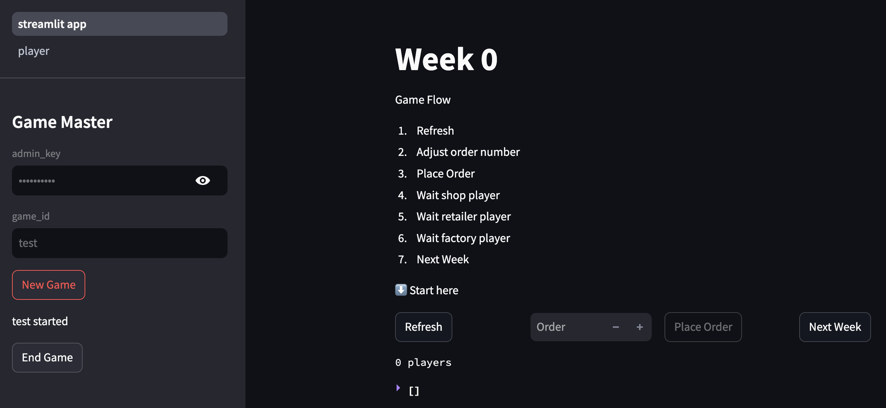
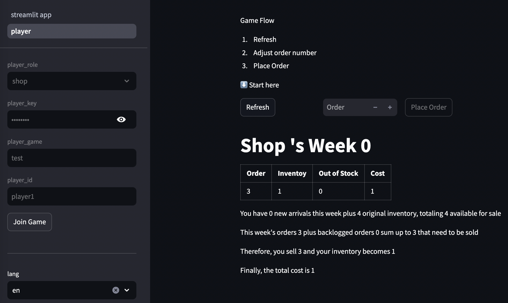
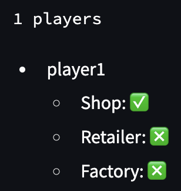
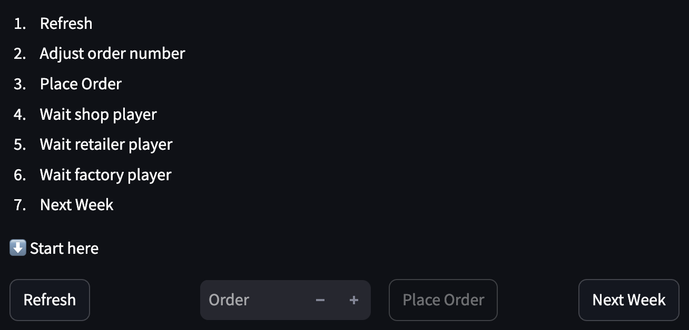
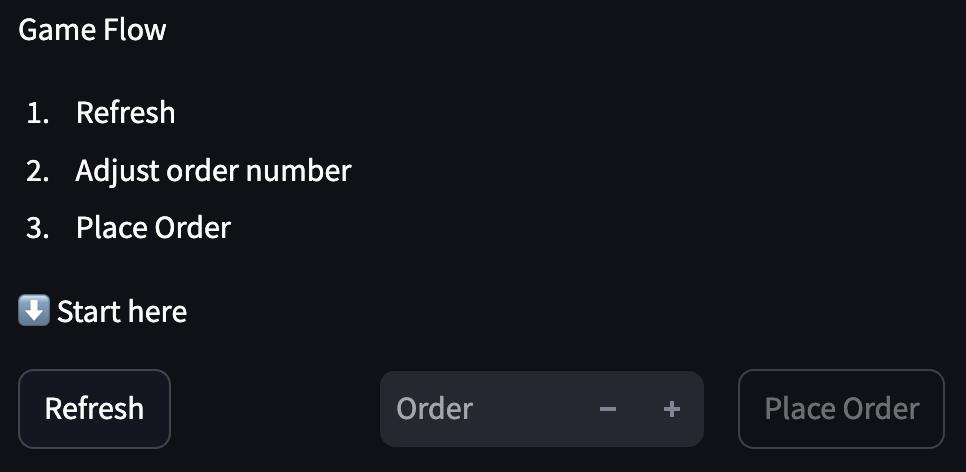

# Beer Game Project

[](https://codecov.io/gh/wirelessr/beer_game)
[](https://github.com/wirelessr/beer_game/actions/workflows/main.yml)


*Host UI*
  
  
  
  

*Player UI*


The entire project is business driven developed and tested with over 90% coverage, so please feel free to use it.

## Preparedness

Create a file for secrets in the project folder. You should see me copy it in the `Dockerfile`.

`.streamlit/secrets.toml`

```toml
[mongo]
uri = "<your mongo connection>"

[admin]
key = "<your admin key>"

[player]
key = "<your player key>"
```

Since this project is using MongoDB, you have to fill in the link with your account password. In addition, `admin.key` and `player.key` correspond to the key fields on the UI.

After all, I'm uploading the app to the public cloud, so I still need a basic authentication mechanism. If you're running locally only and find authentication troublesome, you can remove the corresponding source code.

## Installation and Use

This project has a `Dockerfile` attached, so it can be run directly with `docker`.

```bash
docker build -t beer_game .
docker run --rm --name beer -p 8501:8501 beer_game
```

For development, in addition to `requiremnts.txt`, `requirements-test.txt`, which runs the unit tests, should also be installed. Then you can run all the unit tests through the `Makefile`.

```bash
pip install -r requiremnts.txt
pip install -r requirements-test.txt
make test
```

## Game Flow

The whole game is divided into a host mode and a participant mode, which correspond to the options in the top corner of the UI.

The host first assigns a `game_id` to create the game, and all participants have to fill in the `player_game` with this id.

All players on the same supply chain need to use the same `player_id`, so this id is also known as the supply chain ID, and participants with the same `player_id` are separated into roles by `player_role`.

You can see the status on the host's screen when a participant joins.



Let's look at what a full iteration would look like from the host's point of view.




All the components that need to be manipulated are in this picture, and each turn starts by pressing the `Refresh` button and ends by pressing `Next Week`.

As for how many orders to send to all the supply chains in this round, they will be triggered by `Place Order`.

It's worth mentioning that the `Place Order` itself is idempotent, so it's fine to change the number and press it again, the last number will be used. The `Place Order` of each participant's interface will be idempotent as well.

Once the host has placed the order, the shop player can take the order.




Similarly, each role in the supply chain starts with `Refresh` and ends with `Place Order`, with the shop player taking the action followed by the retailer player, and so on.

Finally, back to the host, who can press `Refresh` again to see all the statuses for the round, and `Next Week` to end the round.

## Game Detail

There are a couple of things actually done during `Refresh`. 

1. it refills inventory from downstream based on orders placed four weeks ago. 
2. it receives orders from upstream.
3. decides how much to sell based on what inventory it can sell.

Since `Place Order` is idempotent, `Refresh` itself is idempotent too.

## Future work

It basically meets all of my needs now, but there are some enhancements that could be made.

For example, the current game flow relies heavily on the host's control, so if a timer could be added to each round, it would make the whole process go much smoother.

Secondly, although the host can see the status of all the participants, it would be helpful to have a graph to show the change of inventory and cost information over time, which would be useful for reviewing the game after it is over.

There's also a more basic problem: the current UI has no test coverage at all, mainly because the current game flow is quite simple. Just a few clicks on the UI will cover all the UI flow, so I don't rely so much on auto-testing. However, if there is a UI modification, it will still be a bit tedious, so it would be better to have a UI unit test.

Overall, these requirements are optimizations, but their lack does not affect the functionality.

If you have additional ideas, you can also just submit a pull request, contributions are welcome.
